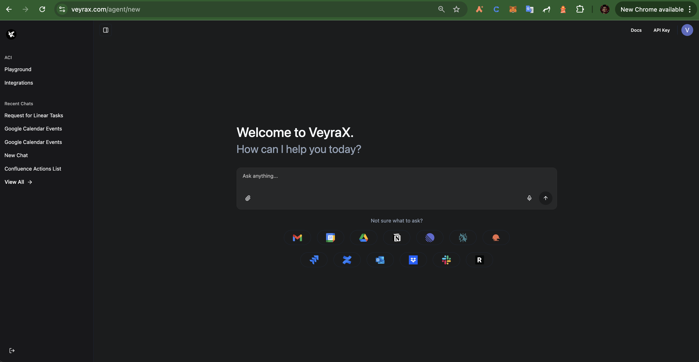
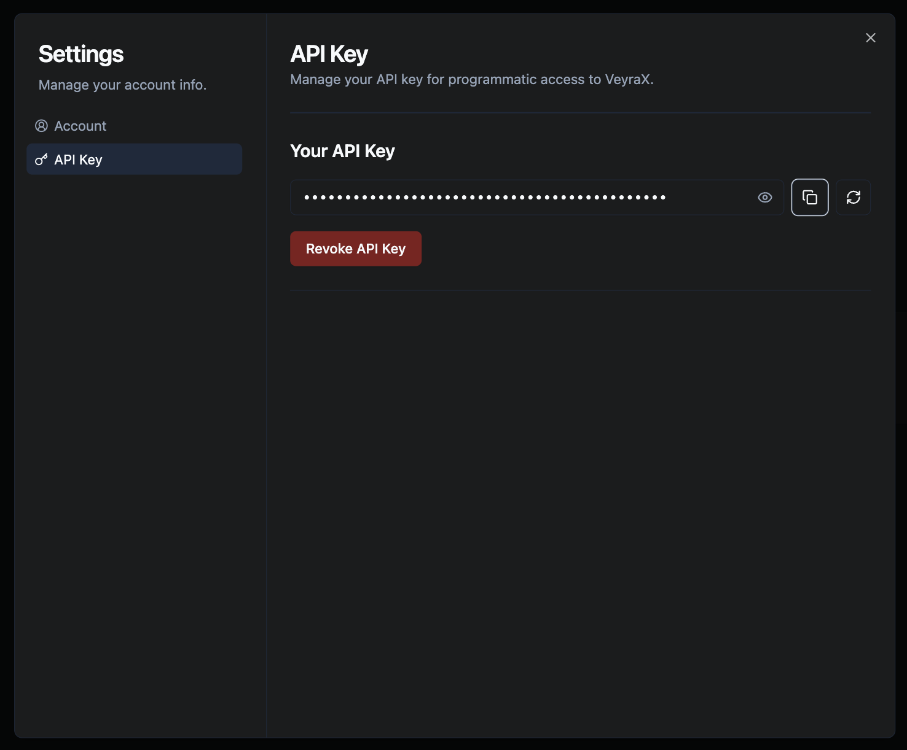

## Step 1: Install Jupyter Notebook

If you need to install jupyter notebook, you can use the following command:

### Unix-like systems (Linux/macOS)
You can use a one-liner in Unix-like systems (Linux/macOS) like this:
```
python3 -m venv jupyter_env && source jupyter_env/bin/activate && pip install notebook && jupyter notebook
```


### Windows
If you’re on Windows, use the following commands instead:
```
python -m venv jupyter_env
jupyter_env\Scripts\activate
pip install notebook
jupyter notebook
```

## Step 2: Open Jupyter Notebook

In your command line, you'll see a localhost link with a token like this:
http://localhost:8888/tree?token={}


## Step 3: Open example notebook, and play with VeyraX


## Step 4: Get your API key

### 4.1: Go to https://www.veyrax.com/agent

### 4.2: Click on the "API" tab on the top right


### 4.3: Copy the API key to .env file


### macOS
```bash
echo "VEYRAX_API_KEY=$(pbpaste)" > .env
```

### Linux (with xclip)
```bash
echo "VEYRAX_API_KEY=$(xclip -o)" > .env
```

### Linux (with xsel)
```bash
echo "VEYRAX_API_KEY=$(xsel --clipboard --output)" > .env
```

### Windows (PowerShell)
```powershell
"VEYRAX_API_KEY=$(Get-Clipboard)" | Out-File -Encoding ascii .env
```

Your `.env` should look like this:  
```
VEYRAX_API_KEY=<clipboard content>
``` 